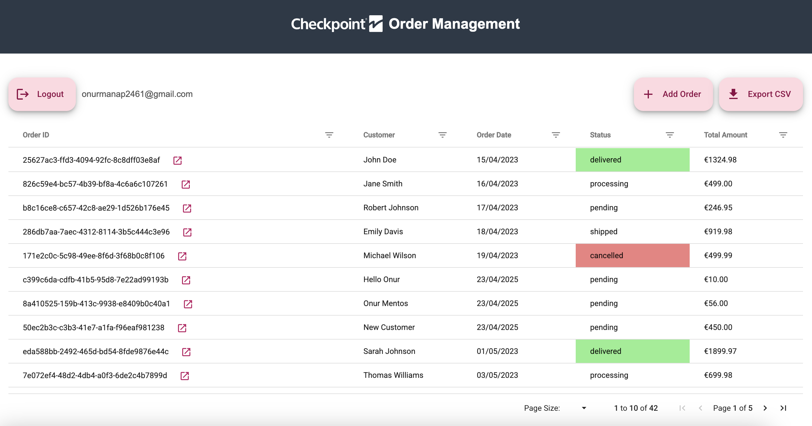
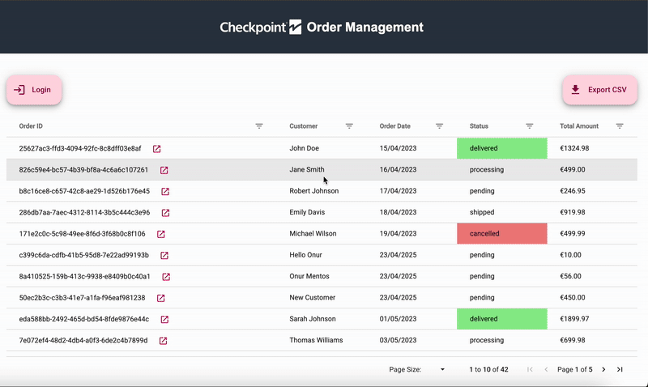
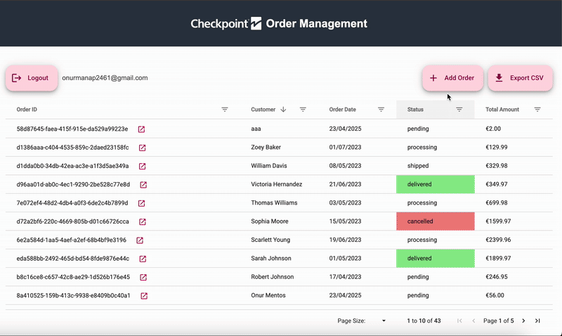
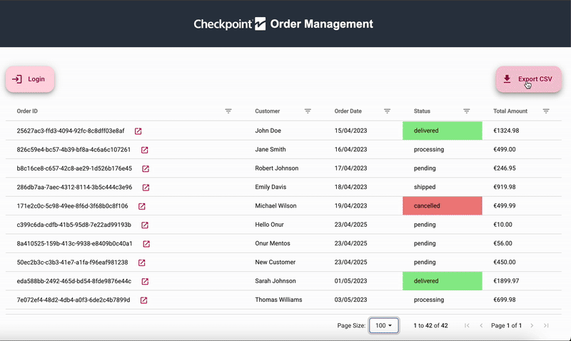

# 📦 Checkpoint Orderbeheer Systeem

Een full-stack orderbeheer applicatie gebouwd met Angular, Express en Supabase.



## 🌟 Functionaliteiten

- 📊 Krachtig datarooster met sortering, filtering en paginering
- 🔐 Veilige authenticatie met Supabase OTP (magic link)
- 📝 Orderdetailweergave met productoverzicht
- ➕ Voeg nieuwe orders toe met een reactief formulier
- 📤 Exporteer naar CSV-functionaliteit
- 🎨 Kleurgecodeerde statusindicatoren

## 🛠️ Technische Stack

- **Frontend**: Angular 19, AG-Grid, Angular Material
- **Backend**: Express.js, TypeScript
- **Database**: Supabase (PostgreSQL)
- **Authenticatie**: Supabase Auth (Magic Link/OTP)
- **Aanvullende Tools**: RxJS, UUID, Morgan, CORS, Dotenv

## 🏗️ Projectstructuur

```
/
├── client/                   # Angular frontend
│   ├── src/
│   │   ├── app/
│   │   │   ├── components/   # UI-componenten
│   │   │   │   ├── add-order-button/ # Knop voor toevoegen order
│   │   │   │   ├── auth/     # Authenticatie componenten
│   │   │   │   ├── auth-callback/ # Auth redirect handler
│   │   │   │   ├── dialog/   # Modale dialoog
│   │   │   │   ├── dialog-form/ # Order formulier dialoog
│   │   │   │   ├── login-button/ # Authenticatie knop
│   │   │   │   └── order-list/  # Hoofdrooster component
│   │   │   └── services/     # Data- en statusdiensten
│   │   └── environments/     # Omgevingsconfiguraties
│   └── ...
└── server/                   # Express backend
    ├── src/
    │   ├── controllers/      # Request handlers
    │   ├── models/           # Data modellen
    │   ├── routes/           # API routes
    │   ├── services/         # Bedrijfslogica
    │   └── app.ts            # Express applicatie
    └── ...
```

## 🚀 Aan de slag

### Vereisten

- Node.js (v16+)
- npm of yarn
- Een Supabase account (voor database en authenticatie)

### Installatie

1. Clone de repository

   ```bash
   git clone git@github.com:checkpt-als/order-management-demo.git
   cd order-management-demo
   ```

2. Installeer afhankelijkheden voor alle componenten

   ```bash
   # Installeer alle afhankelijkheden (server en client)
   npm run install:all

   # Of installeer ze afzonderlijk
   cd server
   npm install

   cd ../client
   npm install
   ```

3. Stel omgevingsvariabelen in

   - Maak een `.env` bestand aan in de server directory

   ```
   SUPABASE_URL=your_supabase_url
   SUPABASE_KEY=your_supabase_key
   ```

   - Update de environment bestanden ook met deze variabelen in `client/src/environments/`

4. Start de ontwikkelservers
   ```bash
   # In de hoofdmap
   npm start
   ```
   Dit zal zowel de client als de server gelijktijdig starten.

## 📱 Gebruik

### Authenticatie

De applicatie gebruikt Supabase's magic link authenticatie:

1. Klik op de "Login" knop
2. Voer je e-mailadres in
3. Controleer je e-mail voor de magic link van Supabase
4. Klik op de link om automatisch ingelogd te worden

### Orderbeheer

- **Orders bekijken**: Alle orders worden weergegeven in het hoofdrooster
- **Filteren/Sorteren**: Klik op kolomkoppen of gebruik de filterpictogrammen
- **Details bekijken**: Klik op het pictogram in de Order ID kolom
  

- **Order toevoegen**: (Alleen geauthenticeerde gebruikers) Klik op de "Order toevoegen" knop
  

- **Gegevens exporteren**: Klik op de "Exporteer CSV" knop
  

## 🧩 API Endpoints

- `GET /api/orders` - Haal alle orders op
- `GET /api/orders/:id` - Haal een specifieke order op via ID
- `POST /api/orders` - Maak een nieuwe order aan

## 🧠 Uitdagingen en Geleerde Lessen

### 🔄 Overstappen van Tech Stacks (van Lit/Firebase naar Angular/Express)

Komend van een achtergrond in LitHTML, Web Components en Firebase, was een van de eerste uitdagingen het aanpassen aan het Angular ecosysteem. Angular's structurele en declaratieve stijl voelde in het begin heel anders aan. Deze verschuiving hielp me echter de kracht van Angular's functies zoals dependency injection, RxJS Observables en de robuuste CLI (`ng generate` voor services, componenten, etc.) te waarderen. Het begrijpen van `ngOnInit()` in de context van Angular's component levenscyclus(lifecycle) voelde vergelijkbaar met `connectedCallback()` of `firstUpdated()` in Web Components, wat de overgang soepeler maakte.

### 📊 AG-Grid Integratie

AG-Grid was een belangrijke leercurve. De uitgebreide API en feature set (sorteren, filteren, paginering, cell rendering) bood veel flexibiliteit, maar het correct configureren vereiste aandacht. Ik begon eerst met een eenvoudige `<table>` setup om de dataflow goed te krijgen voordat ik overging naar AG-Grid. Het implementeren van aangepaste cell renderers vereiste begrip van interfaces zoals `ICellRendererAngularComp`, en ik moest expliciet `agInit()` en `refresh()` implementeren om typeproblemen op te lossen.

### ⚙️ Express API en Middleware

Op de backend gebruikte ik Express.js met in-memory opslag om alles lichtgewicht te houden. Het integreren van `morgan("dev")` hielp bij het loggen en debuggen van requests. Ik voegde basisfoutafhandeling toe voor ongeldige routes en misvormde invoer.

### 🧪 Angular Services & RxJS

Het maken van services met Angular's CLI (`ng generate service`) liet me zien hoe ik datalogica kon loskoppelen van UI-componenten. Het retourneren van `Observable<Order[]>` in plaats van Promises was nieuw voor mij, maar ik begon de flexibiliteit van RxJS te waarderen — vooral bij het omgaan met datastromen of asynchrone flows in formulieren en grid updates.

### 🛠️ Debugging en TypeScript Errors

TypeScript dwong me ook om expliciet te zijn over datacontracten, wat runtime fouten verminderde en de leesbaarheid van de code verbeterde.

## 🔜 Toekomstige Verbeteringen

- Volledige CRUD-operaties in de UI
- Meer gedetailleerde filteropties
- Gebruikersrollen en -rechten
- Ordergeschiedenis bijhouden

- Optimalisaties voor responsive design

---

Gemaakt door Onur Manap voor een technische assessment.
